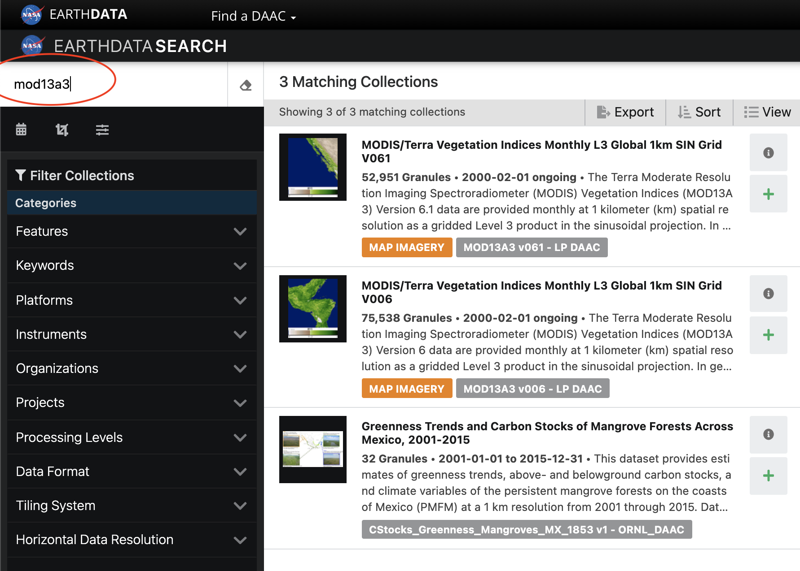

# modis-load

This repository contains instructions and examples of how to batch download MODIS files in various formats.

# MODIS Basics
"MODIS (or Moderate Resolution Imaging Spectroradiometer) is a key instrument aboard the Terra (originally known as EOS AM-1) and Aqua (originally known as EOS PM-1) satellites ... It has a viewing swath width of 2,330 km and views the entire surface of the Earth every one to two days. Its detectors measure 36 spectral bands between 0.405 and 14.385 µm, and it acquires data at three spatial resolutions -- 250m, 500m, and 1,000m." ([NASA](https://modis.gsfc.nasa.gov/about/))

MODIS provides numerous land, ocean, and atmosphere products. Here we will focus on *MODIS land products*, but similar procedures can likely be followed for other products. A list of MODIS products can be found [here](https://modis.gsfc.nasa.gov/data/dataprod/).

A helpful overview of MODIS products can be found [here](https://lpdaac.usgs.gov/data/get-started-data/collection-overview/missions/modis-overview/). This link is particularly helpful for understanding the *naming convention* for MODIS products. 

# Downloading MODIS data
There are a number of different ways to access the MODIS data. This is just one method that I prefer.

## Step 1: Create/Log-in to NASA Earthdata
If you do not have a NASA Earthdata account, then you must first register [here](https://urs.earthdata.nasa.gov/users/new).

If you already created an account, [login](https://urs.earthdata.nasa.gov/).

## Step 2: Find the data you want
The next step is to use the Earthdata search tool to find the data product you want.

You can get to the search tool here: https://search.earthdata.nasa.gov/search or you can also get to it from the [Earthdata homepage](https://earthdata.nasa.gov/) by clicking "Find Data."

In the top left corner of the webpage, type in the MODIS product name and a list of matching collections will appear to the right. Below is an example using the MOD13A3 product (monthly vegetation indices).

Once you click on one of the matching collections, you should see a full list of all the product files. Below is what happens after we click on "MODIS/Terra Vegetation Indices Monthly L3 Global 1km SIN Grid V006" from the list of matching collections.

We see from the example above that there are 75,538 "granules" (i.e., data files) for this particular collection of the MOD13A3 data product. In order to narrow this down to the desired spatial/temporal scale, we need to filter the results in the next step (Step 3).

## Step 3: Filter the results
If you want the data for a particular *time period*, you can do this by either clicking on the small calendar icon, or using the "Temporal" filter tool under "Filter Granules" on the left side. For example, we can set the start and stop time such that only files for the year 2016 are selected (see below).

Click "apply" and you should now see only 3,493 granules returned from the search results. 

